<div align="center">

<!-- Header Banner -->


<!-- Typing Animation -->

[](https://git.io/typing-svg)

</div>

<!-- About Section -->

## `> whoami`

```yaml
name: Abdul Qadir Bearingwala
role: Web Developer
focus: Building real-world projects with clean UI & solid fundamentals
```

<br>

<!-- Tech Stack -->

## Tech Stack

<div align="center">

**Languages**


**Frontend**


**Backend & Database**


**Tools & Platforms**


</div>

<br>

<!-- Featured Projects -->

## Featured Projects

<div align="center">

<!-- ⭐ Hero Project -->
<table>
<tr>
<td>

### GitPulse: GitHub Analytics & Portfolio Platform

**`Next.js 15` `TypeScript` `Tailwind CSS` `MongoDB` `NextAuth.js` `Recharts`**

A full-stack GitHub analytics platform that helps developers showcase their work. Analyzes GitHub profiles to provide deep insights, scores repositories using an advanced algorithm based on best practices, and generates recruiter-friendly, shareable portfolios.

**Highlights:**
Interactive charts for languages, contributions & tech stack • Repo scoring on docs, testing & best practices • AI-generated resume-ready summaries • Shareable public portfolio pages • Admin dashboard with analytics • Smart rate limiting & optimization

[**Live Demo >>**](https://gitpulse-dev.vercel.app)

</td>
</tr>
</table>

<!-- Other Projects -->
<table>
<tr>
<td width="50%">

### [Space Explorer](https://spacelens.vercel.app)

**`HTML` `CSS` `JavaScript` `NASA API`**

A web app for exploring space. Browse daily astronomy pictures, search NASA image archives, track near-Earth asteroids, and learn about space missions. Fully responsive and deployed on Vercel.

[**Live Demo**](https://spacelens.vercel.app) · [**Repository**](https://github.com/Abdulqadir-B/space-explorer)

</td>
<td width="50%">

### [Smart Queue System](https://github.com/Abdulqadir-B/smart-queue-system)

**`JavaScript` `Node.js` `Express` `Socket.io`**

A web-based app to eliminate physical queues. Customers join virtual queues remotely, track position in real-time, and get notified when their turn arrives. Built for hospitals, banks, and government offices.

[**Repository**](https://github.com/Abdulqadir-B/smart-queue-system)

</td>
</tr>
</table>

</div>

<br>

<!-- GitHub Stats -->

## GitHub Stats

<div align="center">


</div>

<br>

<!-- Footer -->
<div align="center">


</div>
